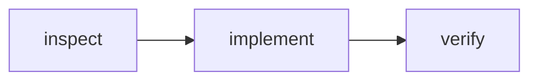

# Planner

Write the plan to `.temp-local/workflow-plan.md`. Keep it concise and
reviewable. For work with dependencies, include Mermaid DAG nodes, their
order, and a verification method per node.

Do not edit product code. Present the plan and wait for a human to approve it.
The next phase is Worker only after approval.
